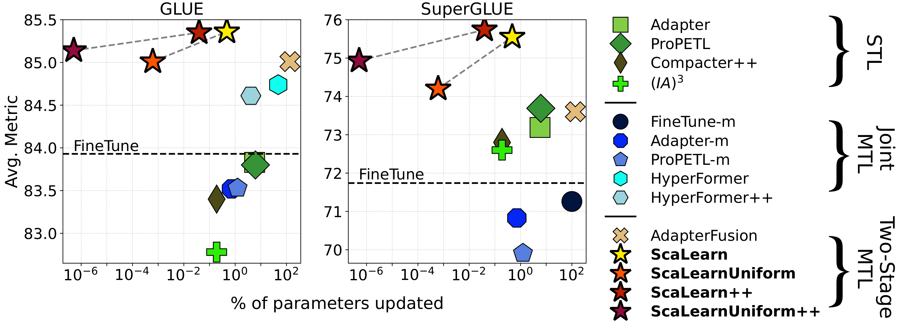

# ScaLearn: Simple and Highly Parameter-Efficient Task Transfer by Learning to Scale
This  repo contains the official implementation of our paper (Markus Frohmann, Carolin Holtermann, Shahed Masoudian, Anne Lauscher, and Navid Rekabsaz)
> [ScaLearn: Simple and Highly Parameter-Efficient Task Transfer by Learning to Scale](https://arxiv.org/abs/2310.01217).

We propose **ScaLearn**, a simple and highly parameter-efficient two-stage multi-task learning method based on adapter layers that outperforms previous single-, joint multi-, and two-stage multi-task learning methods with only a few trainable parameters.




## Installation
### 1.  Set Up Conda Environment
(Optional but recommended) Install & set ``libmamba`` as solver:
```bash
conda install -n base conda-libmamba-solver
conda config --set solver libmamba
```
Create a conda environment and install the necessary dependencies:
```bash
conda create -f env.yml
conda activate <env_name>
```


### 2. Install adapter-transformers
Navigate to the (local) adapter-transformers directory and install the package:

```bash
cd adapter-transformers
pip install .
```

## File Structure
- ``src/run.py`` & ``src/run_multi.py``: defines the run, including training, evaluation, and logging, for non-joint and joint multi-task learning (MTL), respectively. Called in the scripts.
- ``src/arguments.py`` & ``src/arguments_multi.py``: arguments used for all files from the scripts folder.
- ``src/tasks``: defines the task (GLUE, SuperGLUE, HumSet), for non-joint and joint MTL, respectively.
- ``src/training``: sets up the data, trainer, and models.
- ``src/model``: fetches the model used for training.
- ``src/adapters_hf``: used for HyperFormer/HyperFormer++ experiments.
- ``src/adapters_propetl``: used for ProPETL-m experiments.
- ``src/scripts``: contains all the scripts used in the paper.
- ``adapter-transformers``: a modified version of the [original library](https://github.com/adapter-hub/adapter-transformers), including modifications that add the implementations for ScaLearn and its variations, probing, and ProPETL.


## Data
All datasets (GLUE, SuperGLUE, HumSet) will be automatically downloaded (using the ``datasets`` library) when running one of the scripts.

## Training
We use pre-trained versions of (XLM-)RoBERTa-base and (XLM-)RoBERTa-large.  We run each method on a single GPU. All code to reproduce the results is provided in ``src/scripts``. For a comprehensive overview of hyperparameters used, we refer to [our paper](https://arxiv.org/abs/2310.01217) as well as the respective scripts.

With that, you should be able to reproduce the following results using RoBERTa-base, with each group shown as:

- (Top) STL models, only learning a single task at a time. 

- (Middle) Joint MTL methods, learning all tasks simultaneously. 

- (Bottom) Two-stage MTL methods, composing the knowledge of several source adapters.

Evaluation results on **GLUE** using RoBERTa<sub>BASE</sub>: 
| Model                       | MNLI | QQP  | QNLI | SST-2 | STS-B | MRPC | RTE  | CoLA | Avg. |
|-----------------------------|------|------|------|-------|-------|------|------|------|------|
| Full FT                   | 86.61| 90.32| 91.78| 93.33 | 90.53 | 86.94| 73.47| 58.46| 83.93|
| Adapter                | 86.50| 90.18| 92.25| 93.65 | 90.23 | 86.64| 72.89| 58.28| 83.83|
| ProPETL                | 86.19| 88.88| 92.05| 93.81 | 90.03 | 85.93| 74.19| 59.29| 83.80|
| Compacter++                | 85.62| 88.84| 91.79| 93.58 | 89.67 | 87.21| 72.02| 58.49| 83.40|
|-----------------------------|------|------|------|-------|-------|------|------|------|------|
| Full FT-m                 | 84.95| 89.76| 90.91| 92.58 | 86.14 | 83.42| 80.99| 49.12| 82.23|
| Adapter-m              | 86.03| 89.69| 91.58| 93.35 | 88.71 | 86.76| 80.26| 51.79| 83.52|
| ProPETL-m              | 85.23| 87.82| 91.37| 93.88 | 90.27 | 86.36| 78.58| 54.71| 83.53|
| HyperFormer                  | 86.08| 89.13| 91.81| 93.16 | 90.63 | 87.01| 82.79| 57.30| 84.74|
| HyperFormer++                | 86.38| 88.81| 91.99| 93.27 | 90.80 | 87.83| 83.75| 54.05| 84.61|
|-----------------------------|------|------|------|-------|-------|------|------|------|------|
| AdapterFusion         | 86.82| 90.23| 92.48| 93.23 | 90.37 | 88.41| 79.49| 59.04| 85.01|
| **ScaLearn**    | 86.97| 90.32| 92.51| 93.88 | 90.96 | 87.75| 82.06| 58.47| 85.36|
| **ScaLearnUniform** | 86.93| 90.38| 92.53| 93.58 | 90.08 | 87.57| 80.07| 59.04| 85.02|
| **ScaLearn++**    | 87.06| 90.04| 92.03| 94.15 | 90.62 | 88.21| 80.87| 59.82| 85.35|
| **ScaLearnUniform++** | 86.98| 90.38| 92.53| 94.11 | 90.18 | 87.43| 80.04| 59.45| 85.14|

Evaluation results on **SuperGLUE** using RoBERTa<sub>BASE</sub>:

| Model                         | ReCoRD | MultiRC | BoolQ | WiC   | WSC   | COPA  | CB    | RTE   | Avg.  |
|-------------------------------|--------|---------|-------|-------|-------|-------|-------|-------|-------|
| Full FT                     | 71.61  | 71.64   | 76.80 | 66.38 | 63.46 | 68.60 | 81.96 | 73.47 | 71.74 |
| Adapter                  | 79.02  | 72.84   | 76.71 | 65.58 | 63.46 | 70.20 | 84.82 | 72.89 | 73.19 |
| ProPETL                  | 80.29  | 73.07   | 76.58 | 66.60 | 63.46 | 70.60 | 84.46 | 74.19 | 73.69 |
| Compacter++                  | 77.69  | 70.44   | 75.88 | 66.46 | 63.46 | 68.30 | 87.68 | 72.02 | 72.74 |
|------------|-------|--------|------|------|------|------|------|------|------|
| Full FT-m                   | 72.21  | 72.11   | 76.39 | 52.19 | 63.46 | 74.33 | 84.52 | 74.85 | 71.26 |
| Adapter-m                | 72.43  | 72.46   | 75.32 | 51.99 | 59.94 | 71.67 | 86.31 | 76.53 | 70.83 |
| ProPETL-m                | 73.14  | 72.07   | 73.91 | 50.73 | 59.62 | 74.00 | 82.14 | 73.65 | 69.91 |
| HyperFormer                    | 65.93  | 33.54   | 74.01 | 55.49 | 52.88 | 55.50 | 71.43 | 61.73 | 58.81 |
| HyperFormer++                  | 24.50  | 19.47   | 62.17 | 50.00 | 63.46 | 54.33 | 49.40 | 49.09 | 46.55 |
|------------|-------|--------|------|------|------|------|------|------|------|
| AdapterFusion            | 78.82  | 71.79   | 76.72 | 66.57 | 63.46 | 73.10 | 82.32 | 76.03 | 73.60 |
| **ScaLearn**      | 79.52  | 73.22   | 77.27 | 66.35 | 63.46 | 74.80 | 90.89 | 78.88 | 75.55 |
| **ScaLearnUniform**   | 80.13  | 71.91   | 76.06 | 67.37 | 62.50 | 71.20 | 89.11 | 75.31 | 74.20 |
| **ScaLearn++**      | 80.13  | 72.71   | 76.44 | 67.13 | 62.26 | 75.20 | 93.04 | 79.03 | 75.74 |
| **ScaLearnUniform++**   | 79.79  | 71.75   | 76.13 | 67.87 | 63.46 | 74.00 | 91.61 | 74.84 | 74.93 |

Evaluation results on **HumSet** using XLM-R<sub>BASE</sub>.

| Model                         | Sectors | Pillars 1D | Subpillars 1D | Pillars 2D | Subpillars 2D | Avg.  |
|-------------------------------|---------|------------|---------------|------------|---------------|-------|
|  Full FT                     | 71.99   | 50.40      | 43.76         | 61.04      | 41.68         | 53.77 |
| Adapter                  | 71.38   | 51.02      | 43.26         | 61.43      | 42.46         | 53.91 |
| ProPETL                  | 71.69   | 49.69      | 41.63         | 60.58      | 39.85         | 52.69 |
| Compacter++                  | 69.97   | 37.37      | 37.76         | 58.13      | 33.10         | 47.26 |
|------------|--------|-----------|--------------|-----------|--------------|------|
| Full FT-m                   | 51.75   | 22.65      | 13.54         | 33.27      | 12.42         | 26.73 |
| Adapter-m                | 56.20   | 28.53      | 16.53         | 35.90      | 18.89         | 31.21 |
| ProPETL-m                | 59.80   | 26.10      | 29.57         | 37.53      | 30.35         | 36.67 |
| HyperFormer                    | 71.08   | 40.65      | 34.16         | 46.22      | 32.47         | 44.92 |
| HyperFormer++                  | 60.42   | 22.07      | 20.35         | 30.55      | 18.90         | 30.46 |
|------------|--------|-----------|--------------|-----------|--------------|------|
| AdapterFusion            | 72.05   | 49.63      | 43.15         | 60.68      | 42.14         | 53.53 |
| **ScaLearn**      | 72.36   | 51.63      | 44.06         | 61.52      | 42.81         | 54.48 |
| **ScaLearnUniform**   | 72.20   | 50.08      | 42.97         | 60.62      | 41.95         | 53.56 |
| **ScaLearn++**      | 72.38   | 51.66      | 44.23         | 61.66      | 42.21         | 54.43 |
| **ScaLearnUniform++**   | 72.02   | 50.78      | 42.60         | 60.82      | 42.14         | 53.67 |


## Acknowledgements
- [transformers](https://github.com/huggingface/transformers)
- [datasets](https://github.com/huggingface/datasets)
- [PETuning](https://github.com/guanzhchen/PETuning), providing a neat base file structure that we (heavily) adapt.
- [adapter-transformers](https://github.com/adapter-hub/adapter-transformers), which has been adapted to incorporate ScaLearn, probing, and ProPETL.
- [HyperFormer](https://github.com/rabeehk/hyperformer), which we use & adapt for all experiments using HyperFormer & HyperFormer++.
- [ProPETL](https://github.com/ChaosCodes/ProPETL), which we use & adapt for all experiments using ProPETL & ProPETL-m.

## Citation
If you find our paper and resources useful, please kindly cite our paper:

```
@article{frohmann2023scalearn,
  title={ScaLearn: Simple and Highly Parameter-Efficient Task Transfer by Learning to Scale},
  author={Frohmann, Markus and Holtermann, Carolin and Masoudian, Shahed and Lauscher, Anne and Rekabsaz, Navid},
  journal={arXiv preprint arXiv:2310.01217},
  year={2023}
}
```

This work received financial support by the State of Upper Austria and the Federal Ministry of Education, Science, and Research, through grant LIT-2021-YOU-215.
The work of Carolin Holtermann and Anne Lauscher is funded under the Excellence Strategy of the German Federal Government and the Länder. The authors would like to thank Benjamin Minixhofer for his invaluable feedback on the manuscript.

## Final Words
We hope this repo is useful for your research. For any questions, please create an issue or send an email to markus.frohmann@gmail.com, and I will get back to you as soon as possible.

